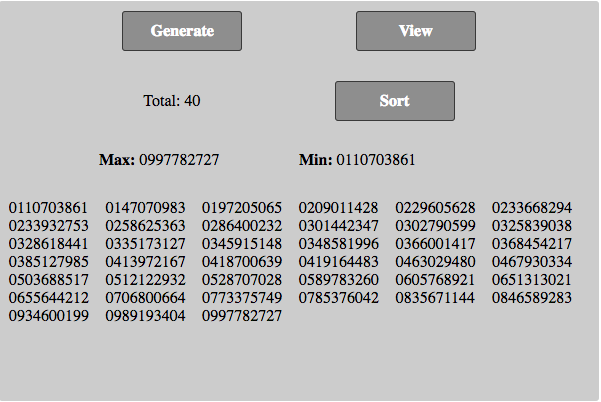

# Phone Number Generator

Random phone number generates 10-digit random number starting with 0.

# Server Set up

- Clone repo
- Install dependencies using `npm install` or `yarn install`
- Start server using `yarn start:dev`
- Access API using `localhost:5600`

> Use `yarn test:coverage` to run the test with coverage`

# Client Set up

Check the readme instructions in [./client/readme.md](./client/README.md) on how to set up the client

# Endpoints

Endpoint | Action
---------|--------------------------------------------------
POST /api/phone-numbers                       | Generates a new phone number on each request
GET /api/phone-numbers                    | Gets all generated phone-numbers
